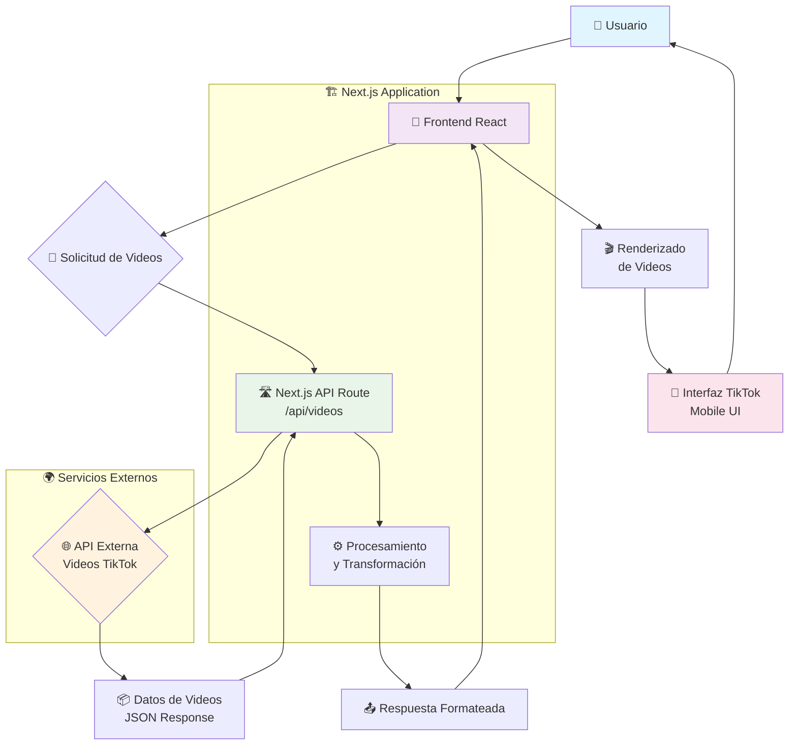

# iTok - TikTok Clone

> Réplica de TikTok (versión móvil) creada con Next.js, TypeScript y Tailwind CSS

Una aplicación web que reproduce la funcionalidad y experiencia visual de TikTok, optimizada para dispositivos móviles y construida con tecnologías web modernas.

## 📚 Índice

- [Características Principales](#-características-principales)
- [Tecnologías Implementadas](#️-tecnologías-implementadas)
- [Arquitectura del Proyecto](#️-arquitectura-del-proyecto)
- [Cómo Funciona](#-cómo-funciona)
- [Características de la Interfaz](#-características-de-la-interfaz)
- [Instalación y Ejecución](#-instalación-y-ejecución)
- [Scripts Disponibles](#-scripts-disponibles)
- [Despliegue](#-despliegue)
- [API Externa](#-api-externa)
- [Contribuciones](#-contribuciones)
- [Licencia](#-licencia)
- [Autor](#-autor)

## 🚀 Características Principales

- **Interfaz móvil responsiva** - Diseño optimizado para smartphones que replica la UX de TikTok
- **Reproducción de videos** - Sistema de scroll infinito con reproducción automática
- **Arquitectura fullstack** - Frontend y backend integrados en una sola aplicación Next.js
- **API externa** - Integración con servicio externo para obtención de contenido de videos
- **Experiencia fluida** - Navegación suave y transiciones similares a la aplicación original

## 🛠️ Tecnologías Implementadas

### Frontend
- **Next.js** - Framework React con renderizado híbrido (SSR/SSG)
- **TypeScript** - Tipado estático para mayor robustez del código
- **Tailwind CSS** - Framework CSS utilitario para diseño rápido y responsivo
- **React** - Biblioteca para construcción de interfaces de usuario

### Backend
- **Next.js API Routes** - Endpoints internos para comunicación con APIs externas
- **RESTful API** - Arquitectura de servicios web para intercambio de datos

### Herramientas de Desarrollo
- **ESLint** - Linter para mantenimiento de calidad de código
- **PostCSS** - Procesador de CSS para optimización
- **Autoprefixer** - Añade prefijos CSS automáticamente para compatibilidad

## 🏗️ Arquitectura del Proyecto

```
itok/
├── pages/
│   ├── api/          # Endpoints del backend
│   │   └── videos/   # API para obtener videos externos
│   ├── index.tsx     # Página principal
│   └── _app.tsx      # Configuración global de la app
├── components/       # Componentes React reutilizables
├── styles/          # Archivos de estilos CSS
├── public/          # Recursos estáticos
├── types/           # Definiciones de tipos TypeScript
└── utils/           # Funciones utilitarias
```

## 🔄 Cómo Funciona

### Diagrama de Flujo del Sistema



### Flujo de Datos Detallado
1. **👤 Interacción del Usuario** - El usuario accede a la aplicación desde su dispositivo móvil
2. **📱 Frontend solicita videos** - El componente React principal realiza una petición al endpoint interno
3. **🛣️ Backend actúa como proxy** - La API Route de Next.js (`/api/videos`) recibe la solicitud del frontend
4. **🌐 Llamada a API externa** - El backend realiza una petición HTTP a la API externa que proporciona videos en formato TikTok
5. **⚙️ Procesamiento de datos** - Los datos se procesan y adaptan al formato requerido por el frontend
6. **📤 Respuesta al cliente** - Los videos procesados se envían al frontend para su renderizado
7. **🎬 Renderizado de videos** - Los componentes React muestran los videos con la interfaz tipo TikTok

### Componentes Clave

#### API Route (`/api/videos`)
```typescript
// Endpoint que maneja las solicitudes de videos
export default async function handler(req: NextApiRequest, res: NextApiResponse) {
  // Lógica para llamar a la API externa
  // Procesamiento y formato de datos
  // Respuesta al frontend
}
```

#### Cliente Frontend
```typescript
// Hook o función que consume la API interna
const fetchVideos = async () => {
  const response = await fetch('/api/videos');
  const videos = await response.json();
  // Actualización del estado con los videos obtenidos
};
```

## 📱 Características de la Interfaz

- **Scroll Vertical Infinito** - Navegación continua entre videos
- **Reproducción Automática** - Los videos se reproducen automáticamente al entrar en el viewport
- **Controles de Video** - Play/pause, volumen, pantalla completa
- **Información del Video** - Título, descripción, autor
- **Diseño Mobile-First** - Optimizado principalmente para dispositivos móviles

## 🚀 Instalación y Ejecución

### Prerrequisitos
- Node.js (versión 14 o superior)
- npm, yarn o pnpm

### Pasos de Instalación

1. **Clonar el repositorio**
```bash
git clone https://github.com/voluspak/itok.git
cd itok
```

2. **Instalar dependencias**
```bash
npm install
# o
yarn install
# o
pnpm install
```

3. **Configurar variables de entorno**
```bash
# Crear archivo .env.local con las configuraciones necesarias
EXTERNAL_API_URL=tu_api_externa_aqui
```

4. **Ejecutar en modo desarrollo**
```bash
npm run dev
# o
yarn dev
# o
pnpm dev
```

5. **Abrir en el navegador**
   - Navegar a [http://localhost:3000](http://localhost:3000)

## 🔧 Scripts Disponibles

```bash
npm run dev      # Servidor de desarrollo
npm run build    # Construcción para producción
npm run start    # Servidor de producción
npm run lint     # Análisis de código con ESLint
```

## 🌐 Despliegue

### Vercel (Recomendado)
La forma más sencilla de desplegar esta aplicación Next.js es usando la [Plataforma Vercel](https://vercel.com/new).

### Otros Proveedores
- **Netlify** - Para despliegues estáticos y serverless
- **Railway** - Para aplicaciones fullstack
- **Heroku** - Para despliegues en contenedores

## 📄 API Externa

El proyecto se integra con una API externa que proporciona videos en formato compatible con TikTok. La comunicación se realiza a través del endpoint interno que actúa como proxy, proporcionando:

- **Seguridad** - Ocultación de claves API del frontend
- **Transformación** - Adaptación de datos al formato requerido
- **Caching** - Posibilidad de implementar caché de respuestas
- **Rate Limiting** - Control de límites de peticiones

## 🤝 Contribuciones

Las contribuciones son bienvenidas. Para contribuir:

1. Fork el proyecto
2. Crea tu Feature Branch (`git checkout -b feature/AmazingFeature`)
3. Commit tus cambios (`git commit -m 'Add some AmazingFeature'`)
4. Push a la Branch (`git push origin feature/AmazingFeature`)
5. Abre un Pull Request

## 📝 Licencia

Este proyecto está bajo la licencia MIT. Ver el archivo `LICENSE` para más detalles.

## 👤 Autor

**voluspak** - [GitHub Profile](https://github.com/voluspak)

---

⭐ Si este proyecto te ha sido útil, ¡no olvides darle una estrella en GitHub!